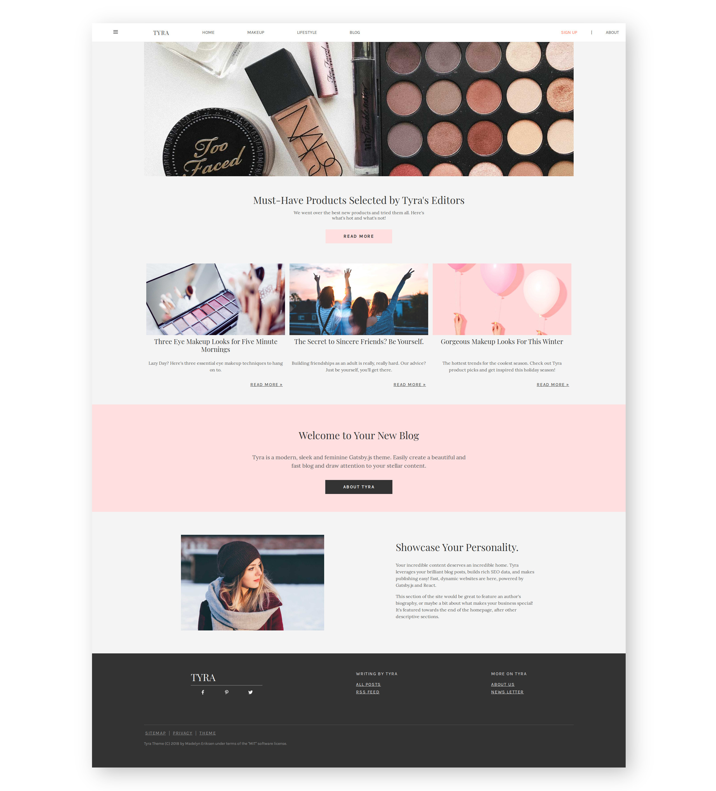

Tyra - Feminine Blog Powered by Gatsby
=====
[](https://shields.io/) [](https://shields.io/)

Tyra is a Gatsby starter that focuses on legibility and a clean, feminine design with 2010 influences. Technically, the goals for Tyra are having a "plug and play" blog, with great SEO, tooling, and integrations all included.

[](https://app.netlify.com/start/deploy?repository=https://github.com/madelyneriksen/gatsby-starter-tyra)

## Getting Started

The first step with using Tyra is customizing your metadata in `gatsby-config.js`.

```javascript
siteMetadata: {
  navbarLinks: [
    {to: "/makeup", name: "Makeup"},
    {to: "/lifestyle", name: "Lifestyle"},
    {to: "/blog", name: "blog"},
  ],
  title: "", // The name of your blog
  description: "", // SEO Description
  siteUrl: "", // Base URL of your blog (https://example.com)
  homepageHeader: "", // Header text for the homepage
  homepageAbout: "", // Banner body for the homepage
  mailChimpUrl: "", // Link you your mailchimp campaign (From the embedded form maker)
  mailChimpToken: "", // The hidden field on mailchimp forms
  pinterest: "", // Your pinterest profile
  facebook: "", // Your facebook profile
  twitter: "", // Your twitter profile
}
```

This is used for configuring data across the site, improving SEO, and increasing engagement on social media.

Next up, you can begin customizing the images and copy in `content/`. Finally, you can add your own blog posts! Posts are written in Markup, an easy way to create webpages.

## Installation with `gatsby-cli`
`gatsby new my-site https://github.com/madelyneriksen/gatsby-starter-tyra`

## Installation with `git clone`
`git clone git@github.com:madelyneriksen/gatsby-starter-tyra.git my-site`
`cd my-site`
`yarn install`

## To develop
`yarn develop`

## To build
`yarn build`


## Screenshot



## Adding your Content

Tyra uses markdown for writing blog posts, and follows a simple template for adding new posts. To add a new blog post, create a file in `content/posts/` with the following:

```markdown
---

type: "post"
title: "My Awesome Post Title"
author: "My Name"
category: "My Category"
date: "2019-01-05"
slug: "/my-awesome-post"
postImage: "./img/myimage.jpg"
metaDescription: "This is my first awesome and cool post!!!"

---

You can write your post here using markdown! Link to images in the `img` folder using this syntax:


```

Images for posts are stored in `content/posts/img/`. Images in the frontmatter will be used as thumbnails for the articles, as well as in search results.

## License

Tyra is licensed under the terms of the MIT License.

## Thanks and Mentions

* The [GatsbyJS](https://www.gatsbyjs.org/) Team for creating an amazing platform.
* [Netlify](https://www.netlify.com/) for making static site hosting even easier.
* [Unsplash](https://unsplash.com/) and the Free Photography Community.
